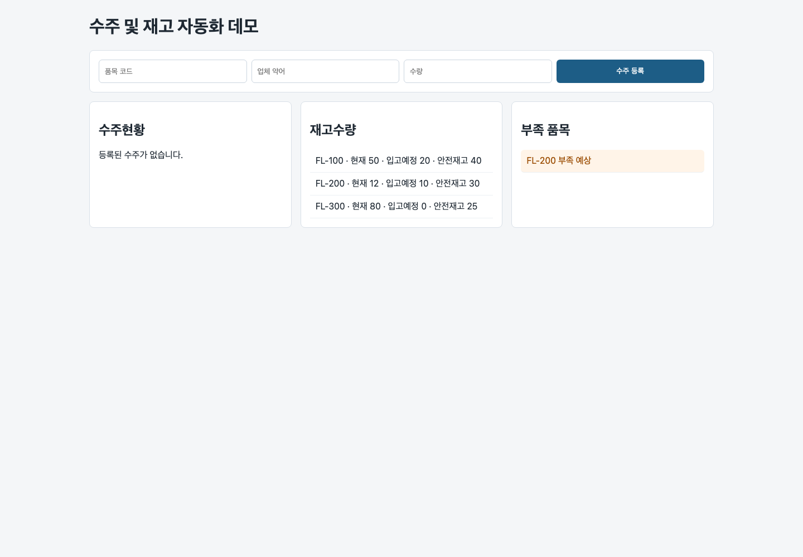

# Sheets Order Inventory Automation

구글 스프레드시트를 데이터 저장소로 사용하는 수주/발주/재고 자동화 데모입니다. 웹 입력 폼으로 수주와 발주 데이터를 등록하고, 재고 차감 및 부족 품목 표시 흐름을 확인할 수 있도록 구성했습니다.



## Portfolio Summary

- 업무 범위: 업무 흐름 분석, 입력 폼 개발, 재고 계산 로직, 스프레드시트 자동화 구조 설계
- 적용 분야: 재고 관리, 업무자동화/RPA, 엑셀 대체, Google Sheets API 연동
- 포트폴리오 상세: [PORTFOLIO.md](./PORTFOLIO.md)

## 문제 상황

수주, 발주, 재고를 엑셀로 관리하면 여러 사람이 동시에 수정하기 어렵고, 입고 예정 수량과 판매 완료 수량을 반영한 부족 품목 확인도 수작업이 되기 쉽습니다. 이 데모는 기존 엑셀 업무 방식을 유지하면서 입력과 계산만 웹/시트 자동화로 옮기는 상황을 가정했습니다.

## 주요 기능

- 수주 정보 입력 폼
- 수입 발주 정보 입력 폼
- 판매 완료 시 재고 차감 흐름
- 현재 재고, 입고 예정, 수주 수량 기반 부족 품목 계산
- 적정 재고 미만 품목 리스트 표시
- Google Sheets API 쓰기 연동을 고려한 데이터 처리 구조

## 기술 스택

- HTML
- CSS
- JavaScript
- Google Sheets API 확장 가능 구조

## 실행 방법

```bash
python3 -m http.server 5175
```

브라우저에서 `http://localhost:5175`로 접속합니다.

## 실서비스 확장 방향

- Google Sheets API 인증 및 지정 시트 쓰기 연동
- 품목/업체/단가 마스터 시트 연결
- 동시 입력 충돌 방지와 수정 이력 관리
- 관리자용 사용 매뉴얼 제공
